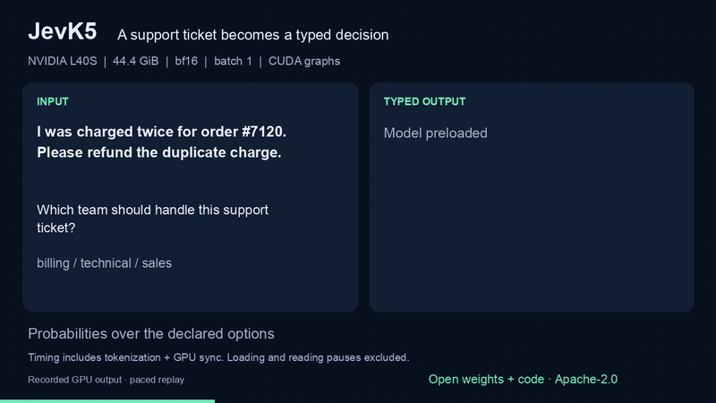
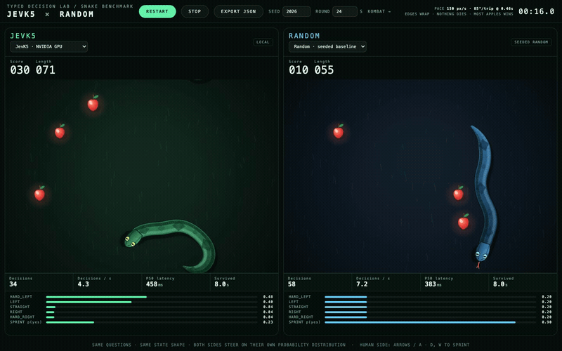
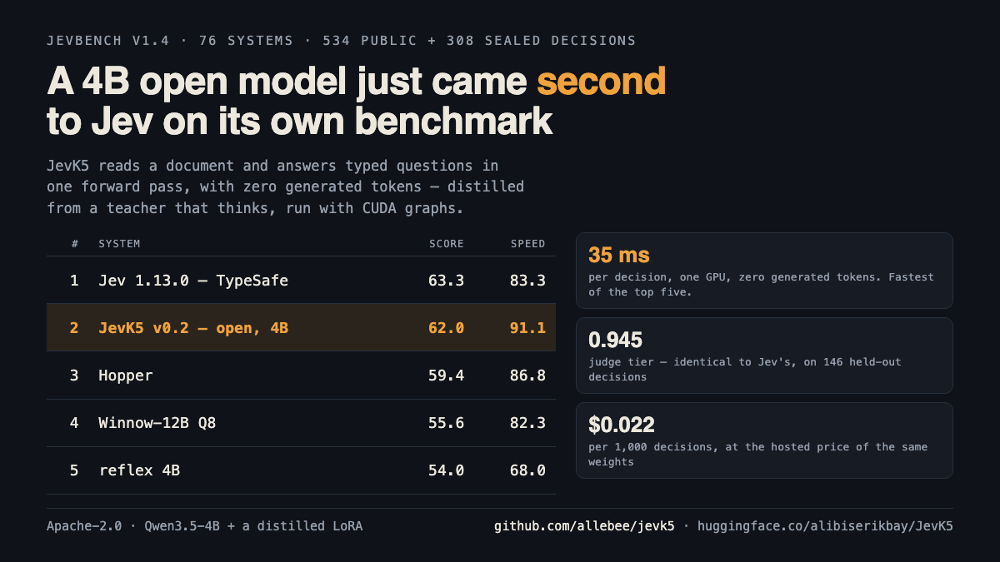

# JevK5 — an open-weight Jev alternative

JevK5 is an independent, Apache-2.0 open-source alternative to TypeSafe's Jev for typed
decisions. Give it a state (a ticket, log, policy, or diff) and a yes/no, choice, or score question.
It returns a probability for every option in one forward pass, with zero generated tokens. The
[weights](https://huggingface.co/alibiserikbay/JevK5) run on your own GPU, and the server accepts
the TypeSafe-style `/v1/systemone` request shape. JevK5 is not affiliated with TypeSafe AI.

**Independent result:** [JevBench v1.4](https://github.com/fstandhartinger/jevbench) ranks JevK5
v0.2 **second of 76 systems and first among open entrants** (62.04; Jev 1.13.0: 63.29). On its
308 fresh sealed decisions, JevK5 answered 33.1% correctly and Jev answered 36.7%; the
[evaluator calls this set unusually difficult](https://github.com/fstandhartinger/jevbench/blob/main/docs/METHOD-v1.4.md).
The ranking measures JevBench's mix of accuracy, calibration, speed, and cost, not performance on
every production workflow. JevK5's reported H100 latency is about 13 ms for short decisions.

## Watch it run

**Typed decision on an NVIDIA L40S.** A real support ticket becomes a probability over three teams;
the displayed decision took 20.60 ms after model loading. This is a paced replay of recorded GPU output.
Click the moving preview for the [full 27-second video](docs/demo/jevk5-nvidia-demo.mp4).

[](docs/demo/jevk5-nvidia-demo.mp4)

**Snake against seeded random.** JevK5 collected 7 apples to random's 3 in a live browser capture
using [Prompt Engineer 48's MIT-licensed arena](https://github.com/PromptEngineer48/laya-vs-jev-arena).
Click the moving preview for the [full 24-second video](docs/game-demos/snake.mp4).
This game is not a Jev comparison.

[](docs/game-demos/snake.mp4)



| | |
|---|---|
| Weights | [alibiserikbay/JevK5](https://huggingface.co/alibiserikbay/JevK5): Qwen3.5-4B + a distilled LoRA, merged (Apache-2.0) |
| Readout | SemIf's protocol: a softmax over the answer letters' next-token logits, one temperature |
| Runtime | One CUDA graph per padded input length: 13 ms vs ~70 ms eager on an H100, same answers |
| Training | Distilled from Qwen3.6-27B with thinking, on hard decisions it wrote and checked twice |

## How JevK5 differs from Jev

JevK5 uses open Qwen3.5-4B weights and [SemIf's option-logit readout](https://github.com/TheoLeeCJ/SemIf),
not Jev's unpublished model architecture. It supports the same three decision types—`noul`
(yes/no), `choice`, and `score`—through a TypeSafe-style endpoint. Each question is evaluated
separately; the server serializes requests on one GPU. The model is English-only, supports up to
16 options, and refuses inputs over 16,384 tokens. Its quality on Jev's published real-world
workflows has not yet been measured.

## Results on JevBench's public items

JevBench v1.2, 231 public items, through JevBench's own runner (`bench/jevk5_direct.py`):
231/231 valid, 0 failures. "Untrained" is the same base model and prompt without the LoRA or the
temperature; its answers match SemIf's official public outcomes on all 231 items.

| Split | n | Untrained Qwen3.5-4B | JevK5 v0.1 | **JevK5 v0.2** |
|---|---:|---:|---:|---:|
| easy | 48 | 1.000 | 1.000 | **1.000** |
| original (standard) | 72 | 0.986 | 0.958 | 0.958 |
| hard (public half) | 111 | 0.613 | 0.676 | **0.739** |
| hard-tier ECE | | 0.117 | 0.082 | **0.066** |
| distance to the exact gold distributions | | 0.298 | 0.296 | **0.196** |

Latency on one H100 (in-process, batch 1): p50 13.5 ms, p95 14.9 ms on easy and standard items;
p50 30 ms, p95 161 ms on hard items with 1-4k-token documents. Per-item results are in
[results/public231](results/public231). These are public-item numbers from our own runs, not an
official JevBench score.

On the hard tier v0.2 fixes 21 of the untrained model's items and breaks 7 (McNemar p = 0.013);
against v0.1 it fixes 9 and breaks 2. Per family, the gains are probability 0.50 -> 0.70, ambiguous
0.71 -> 0.86, trade-offs 0.83 -> 1.00, long policies 0.47 -> 0.58, multi-step lookups 0.72 -> 0.78
and dates and numbers 0.40 -> 0.47; judging answers slips 0.82 -> 0.76 (one item).

**Known weak spots:** two standard-tier items that the untrained model answers correctly are wrong
after training (an unchanged policy pair); the temperature is fitted on hard questions, so
standard-tier confidence is now too low (ECE 0.141 there, against 0.066 on the hard tier).

## Install and use

```bash
pip install "jevk5[fast] @ git+https://github.com/allebee/jevk5@v0.2.0"
```

```python
from jevk5 import JevK5

model = JevK5("alibiserikbay/JevK5")          # ~9 GB of GPU memory in bf16
model.decide(
    "Refunds need a receipt and a purchase within 30 days. "
    "The customer bought 12 days ago and has no receipt.",
    {"type": "noul", "instructions": "Is a refund permitted under the policy?"},
)
# {'type': 'noul', 'confidence': ..., 'noul': <probability of true>, 'input_tokens': ...}
```

Question types: `noul` (yes/no, optional `criteria` {"true": ..., "false": ...}), `choice`
(`criteria` {key: description} or a list of keys), `score` (`criteria` a list of level
descriptions, lowest first).

As a server:

```bash
jevk5-serve --model alibiserikbay/JevK5 --port 8090
curl -s localhost:8090/v1/systemone -d '{"state": "Order #7120 shows delivered to No. 17; the customer lives at No. 71.",
  "questions": {"what": {"type": "choice", "instructions": "What happened to the parcel?",
                         "criteria": ["delivered", "misdelivered", "unknown"]}}}'
```

`flash-linear-attention` (the `fast` extra) speeds up long inputs; without it, Qwen3.5's
linear-attention layers fall back to transformers' PyTorch code.

## Run it on any GPU, a Mac, or a CPU

GGUF builds for [llama.cpp](https://github.com/ggml-org/llama.cpp), which runs on NVIDIA, AMD,
Intel and Apple GPUs and on plain CPUs, are in
[JevK5-GGUF](https://huggingface.co/alibiserikbay/JevK5-GGUF), next to a smaller
[JevK5-2B](https://huggingface.co/alibiserikbay/JevK5-2B) trained the same way. Each file was
checked against its unquantized model on the 231 public items:

| File | Size | Same answer as bf16 | Hard tier (bf16) |
|---|---:|---:|---:|
| `jevk5-4b-v0.2-Q8_0.gguf` | 4.48 GB | 228 / 231 | 0.721 (0.739) |
| `jevk5-4b-v0.2-Q4_K_M.gguf` | 2.71 GB | 219 / 231 | 0.730 (0.739) |
| `jevk5-2b-v0.2-Q8_0.gguf` | 2.01 GB | 226 / 231 | 0.622 (0.604) |

```bash
llama-server --hf-repo alibiserikbay/JevK5-GGUF --hf-file jevk5-4b-v0.2-Q8_0.gguf -c 8192 -ngl 99
pip install --no-deps "jevk5 @ git+https://github.com/allebee/jevk5@v0.2.1"   # standard library only
```

```python
from jevk5 import JevK5GGUF

model = JevK5GGUF()                 # llama-server on :8080; JevK5GGUF(temperature=1.42) for the 2B
model.decide("Order #7120 shows delivered to No. 17; the customer lives at No. 71.",
             {"type": "choice", "instructions": "What happened to the parcel?",
              "criteria": ["delivered", "misdelivered", "unknown"]})
```

It reads the answer letters' log-probabilities from `llama-server`: the same readout as the CUDA
runtime, and on identical tokens the same probabilities. `bench/gguf_check.py` repeats the
231-item comparison on your own machine. Measured so far: about 0.25 s (2B) and 0.6 s (4B) per short
decision on a CPU alone, and 0.6 s for the 4B on an M1 Pro; consumer GPUs are not measured yet.

## How it was made

1. **Teacher data** ([training/teacher.py](training/teacher.py)): Qwen3.6-27B with thinking writes
   realistic documents with three hard typed questions each, across 17 business domains and 11
   decision families (policy exceptions, date and number traps, multi-step lookups, judging
   answers, ambiguity, misleading notes, injected instructions, rule precedence, routing,
   extraction, rubrics). It answers every question twice, independently; a question is kept only
   when both answers match the intended one. Option keys are rebuilt from the option text.
2. **Training** ([training/lora.py](training/lora.py)): LoRA rank 16 on attention projections,
   cross-entropy on the option-letter logits, 3,272 teacher questions + 3,272 human-labelled items
   (MMLU-Pro, WANLI, MultiNLI, BoolQ, banking77, ARC, CommonsenseQA; the MMLU-Pro items came from
   its test split, see [the correction](CHANGELOG.md)), 2 epochs, lr 3e-5. A question
   that carries an exact distribution trains against it rather than a single letter (9 so far).
3. **Calibration:** one temperature (1.532), fitted on teacher questions from three domains that
   training never saw. A temperature per question type and averaging two option orders were both
   measured on held-out data and rejected ([training/temp_choice.py](training/temp_choice.py),
   [training/order_avg.py](training/order_avg.py)).

No JevBench item and no output of Jev was used for training, tuning or model selection (with one correction, see [CHANGELOG](CHANGELOG.md)).

## It also plays Tetris, badly and well

[`examples/tetris.py`](examples/tetris.py) turns Tetris into typed decisions. Reading the board as
characters, JevK5 plays at random: 0.0 lines a game, topping out after 26 pieces, usually taking the
first option offered. Asked instead which placement leaves the best board, with each option
described by what it does ("clears 1 row, buries 0 new cells, tallest column 6"), the same weights
clear **14.9 lines a game** and survive three times longer, at 20-25 ms a decision. A 20-line
heuristic still clears three times more. [What that gap means](examples/README.md).

## Reproduce the JevBench run

See [bench/SUBMISSION.md](bench/SUBMISSION.md).

## Credits

Qwen3.5-4B and Qwen3.6-27B by the Qwen team (Apache-2.0). Prompt and readout adapted from
[SemIf](https://github.com/TheoLeeCJ/SemIf) by TheoLeeCJ (MIT); see [NOTICE](NOTICE).
Evaluated with [JevBench](https://github.com/fstandhartinger/jevbench) (MIT). Not affiliated with
TypeSafe AI or Jev.

## License

Apache-2.0.
